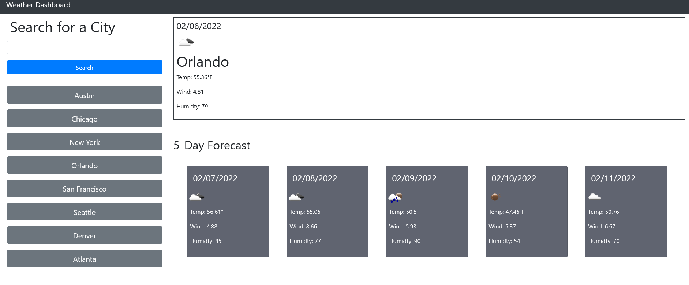

# weather-dashboard-challenge

An app that will retrieve weather data for multiple cities. 

## Challenge Goal

Developers are often tasked with retrieving data from another application's API and using it in the context of their own. The challenge is to build a weather dashboard that will run in the browser and feature dynamically updated HTML and CSS. 

## Technologies

- Html
- Javascript
- CSS
- JQuery
- Moment.js

## Challeng Screenshot

## Deployment

https://christiandc19.github.io/weather-dashboard-challenge/

https://github.com/christiandc19/weather-dashboard-challenge/

